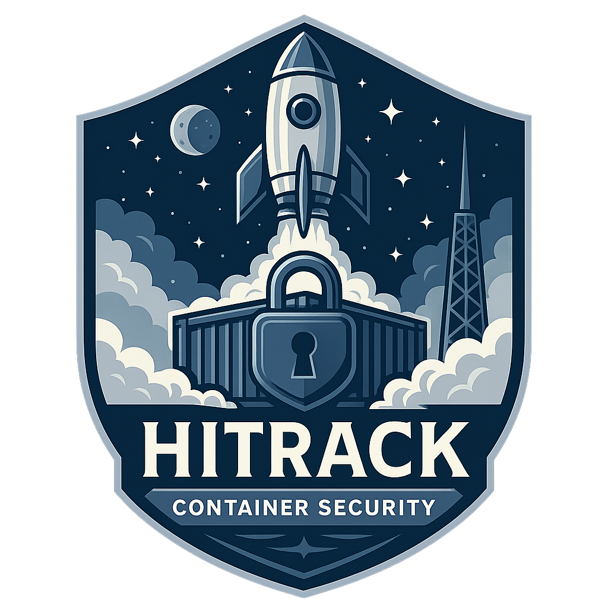
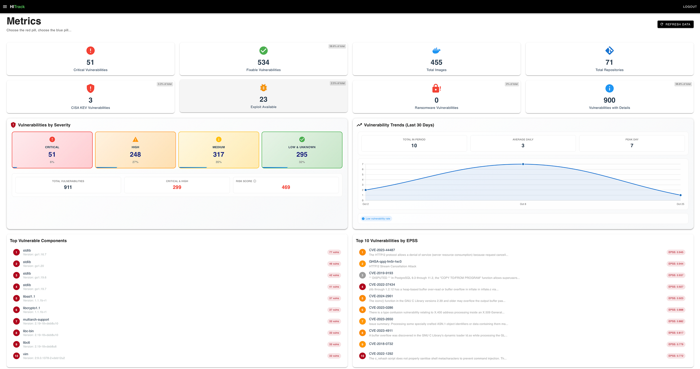
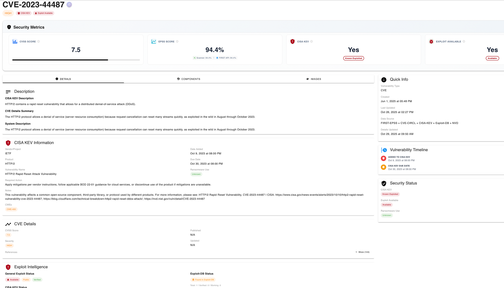

<div align="center">
  

  # HITrack
  ### Container and Helm Security Tracking Platform

  [](https://creativecommons.org/licenses/by-nc-sa/4.0/)
  [](https://www.python.org/)
  [](https://vuejs.org/)
  [](https://www.djangoproject.com/)
</div>

HITrack is a self-hosted platform for scanning container repositories and Helm charts, storing SBOM/component data, and tracking vulnerabilities across repositories, tags, images, components, and releases.

It is built around Syft for SBOM generation, Grype for vulnerability matching, Django + Celery for backend processing, and Vue/Vuetify for the UI.

<p align="center">
  
  
</p>

## What HITrack Does

- Scans Docker images and Helm repositories.
- Supports registry-driven workflows for Azure Container Registry and JFrog Artifactory.
- Lets you scan either the latest tag only or full tag history.
- Generates SBOM data with Syft and vulnerability findings with Grype.
- Tracks components, versions, PURLs, CPEs, and component locations inside images.
- Aggregates vulnerabilities across images/components and exposes fixability data.
- Enriches vulnerability records with metadata such as EPSS, exploit availability, and CISA KEV flags.
- Organizes repository tags into releases and generates Excel vulnerability reports.
- Provides dashboards, trend views, component matrices, task monitoring, and admin screens.

## Architecture

The default `docker-compose.yml` starts the full platform:

- `httpd`: reverse proxy and entrypoint for the UI/API on `127.0.0.1:1337`
- `hitrack-frontend`: Vue 3 + Vuetify frontend
- `hitrack-api`: Django REST API, admin, migrations, and app bootstrap
- `worker-light`: Celery worker for lightweight/orchestration/metadata tasks
- `worker-scan`: Celery worker for heavy scanning/image/SBOM/Grype tasks
- `worker-enrichment`: Celery worker for vulnerability enrichment, EPSS/KEV/exploit metadata refresh, and bulk CVE detail updates
- `beat`: dedicated Celery Beat scheduler for django-celery-beat cron jobs
- `hitrack-db`: PostgreSQL 17
- `hitrack-redis`: Redis for task queue/broker

Important runtime notes:

- The backend container mounts `/var/run/docker.sock`, because scanning workflows invoke container tooling from inside the app container.
- The backend image installs `syft`, `grype`, `helm`, and Docker CLI during build.
- Persistent project data is stored in local folders such as `volume/`, `storage/`, and `static_data/`.
- Celery traffic is split into `light`, `scan`, and `enrichment` queues so long-running vulnerability metadata refreshes do not starve either image scanning or lightweight scheduled/admin tasks.

## Supported Workflows

### Registries and repositories

- Add repositories manually, or import them from a configured container registry.
- Current UI and backend flows actively support:
  - Azure Container Registry (ACR)
  - JFrog Artifactory
- Repositories can be classified as Docker or Helm.

### Scanning

- Scan all tags in a repository.
- Scan latest tags only for faster, lower-noise processing.
- Parse SBOM data into shared component/component-version records.
- Rescan existing images and reanalyze stored SBOM data.

### Helm-specific behavior

- Detects Helm repositories/charts.
- Extracts referenced images from Helm charts.
- Supports native Helm repositories in Artifactory as well as OCI-style Helm artifacts.
- Lets Helm repositories define fallback Docker repositories when chart image references are incomplete or broken.

### Analysis and reporting

- Dashboards for platform-wide metrics and trends.
- Repository, tag, image, component, and vulnerability detail pages.
- Release management with repository-tag assignments.
- Release-based and image-based Excel report generation.
- OpenAPI schema and interactive API docs.

## Quick Start

### Prerequisites

- Docker
- Docker Compose
- Access to Docker socket on the host running HITrack

### 1. Clone the repository

```bash
git clone git@github.com:malchikserega/HITrack.git
cd HITrack
```

### 2. Review environment settings

The default runtime settings live in [`env.env`](env.env). Out of the box, the compose stack expects:

- PostgreSQL at `hitrack-db:5432`
- Redis at `hitrack-redis:6379`
- Time zone `America/New_York`

Optional admin bootstrap variables:

- `SUPERUSER_NAME`
- `SUPERUSER_PSWD`

If they are not set, HITrack creates a default superuser with:

- Username: `admin`
- Password: `P@ssw0rd`

### 3. Start the platform

```bash
docker compose up --build -d
```

The first build can take a while because the backend image installs scanning dependencies.

### 4. Open the application

- UI: [http://127.0.0.1:1337](http://127.0.0.1:1337)
- Django admin: [http://127.0.0.1:1337/admin/](http://127.0.0.1:1337/admin/)
- Swagger UI: [http://127.0.0.1:1337/api/docs/](http://127.0.0.1:1337/api/docs/)
- ReDoc: [http://127.0.0.1:1337/api/redoc/](http://127.0.0.1:1337/api/redoc/)

### 5. First-use flow

1. Sign in with the admin account.
2. Configure one or more registries in the admin or via the repository import UI.
3. Add repositories manually or import them from ACR/JFrog.
4. Scan the latest tag or full repository history.
5. Review results in repositories, images, components, vulnerabilities, releases, and reports.

## Development

### Recommended local setup

For most development work, it is easiest to run the infrastructure with Docker Compose and then work on backend/frontend code locally as needed.

### Backend

```bash
cd HITrack
python -m venv venv
source venv/bin/activate
pip install -r requirements.txt
```

Start dependencies:

```bash
cd ..
docker compose up -d hitrack-db hitrack-redis
```

Run the backend locally:

```bash
cd HITrack
python manage.py migrate
python manage.py init
python manage.py runserver 0.0.0.0:8000
```

If you want scanning workflows to work outside Docker, your local environment also needs access to:

- `syft`
- `grype`
- `helm`
- Docker CLI / Docker socket

### Celery worker

```bash
cd HITrack
celery -A hitrack_celery worker --queues=light --loglevel=INFO
```

### Frontend

```bash
cd HITrack-frontend
npm install
export VITE_API_URL=http://localhost:8000/api
npm run dev
```

## API and Auth

- Backend API routes are served under `/api/`
- JWT endpoints:
  - `/api/auth/token/`
  - `/api/auth/token/refresh/`
  - `/api/auth/token/verify/`
- OpenAPI schema:
  - `/api/schema/`
  - `/api/docs/`
  - `/api/redoc/`

## Troubleshooting

### Artifactory: use the base URL, not a repo key path

For JFrog setup, use the Artifactory base URL so HITrack can discover repository keys through the REST API.

- Correct: `https://repo.example.com/artifactory`
- Wrong: `https://repo.example.com/artifactory/some-docker-repo`

HITrack uses the base URL to query Artifactory APIs such as `GET /api/repositories`, then lets you select the relevant Docker or Helm repo keys.

### Superuser credentials

If you want to override the default admin account, set these before startup:

```bash
export SUPERUSER_NAME=myadmin
export SUPERUSER_PSWD='replace-me'
docker compose up --build -d
```

### KeyError: `fix` during migrations

If you hit a migration error related to removing the `fix` field, check the migration target model carefully. The `fix` field belongs to `ComponentVersionVulnerability`, not `Vulnerability`.

Helpful search command:

```bash
grep -r "RemoveField\\|name=.fix" HITrack/core/migrations/
```

If a migration wrongly references:

```python
RemoveField(model_name='vulnerability', name='fix')
```

it should either be removed or corrected to the through model, depending on your intended schema change.

## Repository Structure

```text
HITrack/
├── HITrack/             # Django project, API, models, tasks, migrations
├── HITrack-frontend/    # Vue/Vuetify frontend
├── redis/               # Redis image build context
├── httpd/               # Apache reverse proxy configuration
├── docs/                # Screenshots and branding assets
├── storage/             # Generated files and runtime data
├── static_data/         # Collected static assets
├── volume/              # PostgreSQL volume data
├── docker-compose.yml   # Full local stack
└── env.env              # Default environment variables
```

## License

This project is licensed under the **Creative Commons Attribution-NonCommercial-ShareAlike 4.0 International License** (CC BY-NC-SA 4.0).

## Contributors

- **Sergei Ovchinnikov** ([@malchikserega](https://github.com/malchikserega))
- **Ilya Kostyulin** ([@vmvarga](https://github.com/vmvarga))

## Publication

- [Humble image security tracking with Syft + Grype under the hood](https://medium.com/@malchikserega/humble-image-security-tracking-with-syft-grype-under-the-hood-76120e917029)

## Acknowledgments

- [Syft](https://github.com/anchore/syft) for SBOM generation
- [Grype](https://github.com/anchore/grype) for vulnerability scanning
- [Helm](https://helm.sh/) for chart inspection and templating
- [Django](https://www.djangoproject.com/) and [Vue.js](https://vuejs.org/) for the application stack
